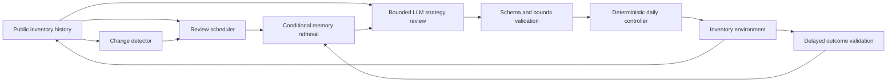

<div align="center">

# ShiftMem

### Change-aware conditional memory for inventory agents under regime shifts

An evidence-first research system for studying when an LLM agent should keep,
revise, or retire operational experience after its environment changes.

[English](README.md) · [简体中文](README.zh-CN.md)

[](https://github.com/QCYTSN/Shiftmem/actions/workflows/ci.yml)
[](https://qcytsn.github.io/Shiftmem/)
[](paper/README.md)
[](paper/ShiftMem.pdf)


[](LICENSE)

</div>

---

> ## 🔬 ShiftMem Evidence Lab · Live Web App
>
> Replay the frozen 160-cell experiment, compare ShiftMem with VectorMemory,
> inspect memory lifecycles, and trace every result back to verified evidence.
>
> **[Open the Evidence Lab in your browser →](https://qcytsn.github.io/Shiftmem/)**<br>
> No installation, API key, or provider access is required.
>
> [Run locally](#run-the-demo) · [Demo guide](demo-web/README.md) ·
> [Product and integrity specification](docs/demo_design_spec.md) ·
> [Formal evidence audit](docs/v2_formal_post_test_audit.md)

> ## 📄 Manuscript · Complete source package
>
> **Does Conditional Memory Help an LLM Inventory Agent under Regime Shifts?**<br>
> **A Systems Evaluation Frozen before Test-Outcome Access**
>
> The complete LaTeX manuscript, references, publication figures, source tables,
> and reproducible figure generator are included in the repository.
>
> **[Open the manuscript guide →](paper/README.md)** ·
> **[Download the compiled PDF](paper/ShiftMem.pdf)** ·
> [Main TeX source](paper/main.tex) ·
> [Figures](paper/figures/) ·
> [Tables](paper/tables/)

## At a glance

| | |
| --- | --- |
| **Research question** | Can change-aware memory improve LLM-guided inventory adaptation under demand and supply shifts? |
| **Agent authority** | Three bounded strategy parameters; daily ordering remains deterministic |
| **Formal evaluation** | 160 complete cells, 2 models, 2 methods, 8 held-out scenarios, 5 paired seeds |
| **Primary endpoint** | 70 paired change-adaptation units |
| **Main finding** | ShiftMem did **not** outperform VectorMemory overall |
| **Evidence status** | Frozen, checksummed, network-free, and reproducible |
| **Manuscript status** | Complete LaTeX source with three publication figures, three source tables, references, and appendices |

## Paper

The manuscript reports the complete systems evaluation, including the negative
primary result, dependence-aware sensitivity analysis, descriptive subgroup
results, reliability audit, limitations, and evidence-availability statement.
Its claims are aligned with the frozen Protocol-v2 outputs rather than selected
from the interactive Demo.

- [Manuscript and build guide](paper/README.md)
- [Compiled manuscript PDF](paper/ShiftMem.pdf)
- [Main manuscript source](paper/main.tex)
- [Paper figures](paper/figures/) and [source tables](paper/tables/)
- [Figure generation script](scripts/make_paper_figures.py)
- [Code and data availability statement](paper/availability.tex)

## Why ShiftMem?

Operational experience can become misleading when the environment changes.
ShiftMem treats memory as conditional rather than permanently valid:

- experiences record the conditions under which they were learned;
- regime changes can make memories dormant instead of deleting them;
- later evidence can support, demote, or reactivate a memory;
- retrieved memories must be cited in bounded strategy proposals;
- delayed outcomes update the memory lifecycle.

The LLM does **not** place daily orders. It may only propose:

1. a demand forecast window;
2. a safety-stock multiplier;
3. a lead-time buffer.

A shared deterministic controller executes the actual inventory policy. The
agent cannot see future demand, hidden regime labels, or Oracle context.



## Run the Demo

The public, read-only web application is available at
**[qcytsn.github.io/Shiftmem](https://qcytsn.github.io/Shiftmem/)**. It is
deployed from the frozen evidence package by GitHub Actions and makes no
provider calls.

For local inspection or development, use the steps below. The local and hosted
versions are generated from the same verified evidence export.

Requirements: Python 3.12+, Node.js 22+, and pnpm.

```powershell
git clone https://github.com/QCYTSN/Shiftmem.git
cd Shiftmem

py -3.12 -m venv .venv
.venv\Scripts\Activate.ps1
python -m pip install -e ".[test]"

# Verify and export deterministic browser data.
python -m demo.export_web

# Start the Evidence Lab.
cd demo-web
corepack enable
pnpm install --frozen-lockfile
pnpm dev
```

Open **http://127.0.0.1:5173**.

The browser never scans raw-run directories. In a clean clone, Python verifies
the tracked release archive and each requested source before emitting
browser-safe view models.

The Evidence Lab contains four connected views:

- **Episode Lab** — synchronized replay of demand, inventory, orders, cost,
  strategy reviews, fallbacks, and regime changes;
- **Compare** — strictly paired ShiftMem and VectorMemory evidence;
- **Memory Audit** — retrieval, citation, support, failure, dormancy, and
  reactivation histories;
- **Evidence & Method** — provenance, definitions, aggregate results, and
  explicit claim boundaries.

## Formal result

The predeclared Protocol-v2 analysis remains authoritative.

| Analysis | ShiftMem − VectorMemory | 95% interval | p-value | Interpretation |
| --- | ---: | ---: | ---: | --- |
| Predeclared primary analysis | +45.44 | [-2.72, 93.60] | 0.203 | H1 not supported |
| Clustered mean sensitivity | +45.44 | [11.26, 79.09] | 0.041 | Post-hoc; unfavorable to ShiftMem |

Positive values indicate a higher 30-day oracle-relative cost gap for
ShiftMem. Across the 70 primary pairs, ShiftMem won 25, tied 11, and lost 34.
Test-ID was approximately neutral (-2.67), while Test-OOD was unfavorable
(+81.53). DeepSeek and MiniMax also showed opposite method-effect directions.

This is a preserved negative result, not a failed project: the evidence rejects
a universal superiority claim and instead points to model- and
condition-dependent behavior.

## Verify the evidence

Verification is deterministic, network-free, and credential-free:

```powershell
python -m pytest -q
python scripts/verify_release_archive.py
```

Expected closure:

- 160/160 formal cells;
- 70 primary paired units;
- 11/11 raw evidence sources verified;
- zero unresolved reservations;
- closure identity `v2-formal-results-f4ab41daacf3`.

The original research workspace can additionally reconstruct every aggregate
output:

```powershell
python scripts/finalize_formal_results.py --verify
```

### Primary evidence

- [Evidence manifest](artifacts/aggregated/v2_formal_evidence_manifest.json)
- [Formal statistical analysis](artifacts/aggregated/v2_formal_statistical_analysis.json)
- [Reliability audit](artifacts/aggregated/v2_formal_reliability_audit.json)
- [Frozen raw-evidence archive](artifacts/releases/v2-formal-results-f4ab41daacf3-raw-evidence.zip)
- [Archive checksum](artifacts/releases/v2-formal-results-f4ab41daacf3-raw-evidence.sha256.json)

## Reliability is part of the result

Provider and parsing failures were retained in the evaluated business outcome:

| Signal | Observed |
| --- | ---: |
| Strategy reviews | 5,176 |
| Cell-recorded attempts | 6,189 |
| Parse failures | 1,680 (27.1%) |
| Retained-strategy fallbacks | 667 (12.9% of reviews) |
| Terminal provider failures | 1,705 |
| Unresolved reservations | 0 |

The experiment therefore estimates the tested systems as deployed, including
their fallback behavior. It does not isolate a pure memory mechanism from model
compliance or provider reliability.

## Repository guide

| Path | Purpose |
| --- | --- |
| [`paper/`](paper/README.md) | Complete manuscript source, references, figures, tables, and build instructions |
| [`demo-web/`](demo-web/README.md) | Official React and TypeScript Evidence Lab |
| [`demo/`](demo/README.md) | Verified Python evidence adapter and browser exporter |
| [`src/shiftmem/`](src/shiftmem/) | Environment, agents, memory lifecycle, control, and evaluation |
| [`configs/`](configs/) | Experiment, split, validation, and immutable freeze configurations |
| [`scripts/`](scripts/) | Verification, aggregation, and explicit experiment entry points |
| [`tests/`](tests/) | Unit and integration test suite |
| [`artifacts/aggregated/`](artifacts/aggregated/) | Machine-readable formal results |
| [`artifacts/releases/`](artifacts/releases/) | Frozen evidence package and checksum |
| [`docs/`](docs/README.md) | Protocol, audits, reports, model card, and history |

## Scope

Current evidence covers a synthetic, single-item lost-sales inventory setting,
two provider-hosted model families, one bounded three-parameter controller, and
five seeds per scenario. It does not establish general superiority across all
memory systems, causal benefit from memory dormancy, or transfer to real
multi-item enterprise operations.

See the [formal post-Test audit](docs/v2_formal_post_test_audit.md) for the full
interpretation, limitations, and permitted claims.

## License

The software source code in this repository is available under the
[MIT License](LICENSE).

The manuscript, compiled PDF, figures, tables, bibliography, and other
scholarly content under [`paper/`](paper/) are excluded from the MIT License
and remain copyright © 2026 Fengkai Gao, all rights reserved, unless a future
publisher or archival venue specifies a different license. See the
[paper-specific license notice](paper/LICENSE).
