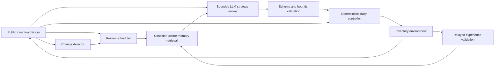

# ShiftMem

**Change-aware conditional memory for inventory agents under regime shifts.**

ShiftMem studies whether an LLM agent should keep treating past strategy
experience as valid after demand or supply conditions change. The system gives
the LLM a deliberately narrow role: it reviews three bounded strategy
parameters at scheduled intervals or detected changes, while a shared
deterministic controller executes every daily inventory order.

The Protocol-v2 held-out experiment is complete. Its primary result is a
carefully preserved negative result: under the tested models, scenarios, and
provider conditions, ShiftMem did **not** outperform VectorMemory overall.

## Headline result

The formal matrix contains 160 complete cells: two models, two methods, eight
held-out scenarios, and five paired environment seeds. Stable scenarios are
descriptive; the declared change-adaptation endpoint contains 70 paired units.

| Analysis | ShiftMem − VectorMemory | 95% interval | p-value | Status |
| --- | ---: | ---: | ---: | --- |
| Predeclared primary analysis | +45.44 | [-2.72, 93.60] | 0.203 | H1 not supported |
| Clustered mean sensitivity | +45.44 | [11.26, 79.09] | 0.041 | Post-hoc; unfavorable to ShiftMem |

Positive values mean a higher 30-day **oracle-relative cost gap** for ShiftMem.
ShiftMem won 25 pairs, tied 11, and lost 34. Test-ID was approximately neutral
(-2.67), while Test-OOD was unfavorable (+81.53). DeepSeek and MiniMax showed
opposite method-effect directions, so the evidence supports a conditional,
model-dependent interpretation rather than a universal memory advantage.

The predeclared result remains authoritative. The clustered analysis is a
mean-aligned sensitivity analysis and is not presented as a replacement
confirmatory test. See the [formal post-Test audit](docs/v2_formal_post_test_audit.md)
for the full interpretation and claim boundaries.

## System design



The LLM may propose only:

- demand forecast window;
- safety-stock multiplier;
- lead-time buffer.

It cannot emit daily orders, change the controller, see future demand, access
the hidden regime label, or use Oracle context. Invalid model output receives
one repair attempt; otherwise the previous valid strategy remains active and
the failure stays in the business outcome.

## Reproduce the closure

Python 3.12 or newer is required. Evidence verification is network-free and
does not require provider credentials.

```powershell
py -3.12 -m venv .venv
.venv\Scripts\Activate.ps1
python -m pip install -e ".[test]"
python -m pytest -q
python scripts/finalize_formal_results.py --verify
```

Expected verification status:

- 160/160 formal cells;
- 70 primary paired units;
- zero unresolved reservations;
- all source-freeze and SHA-256 checks valid;
- current closure identity: `v2-formal-results-f4ab41daacf3`.

## Evidence and outputs

- [Evidence manifest](artifacts/aggregated/v2_formal_evidence_manifest.json)
- [Formal statistical analysis](artifacts/aggregated/v2_formal_statistical_analysis.json)
- [Reliability and execution-order audit](artifacts/aggregated/v2_formal_reliability_audit.json)
- [Read-only raw-evidence archive](artifacts/releases/v2-formal-results-f4ab41daacf3-raw-evidence.zip)
- [Archive checksum](artifacts/releases/v2-formal-results-f4ab41daacf3-raw-evidence.sha256.json)

The raw formal inputs were not rewritten during post-Test analysis. The closure
manifest binds five cell files, four journals, two summaries, analysis code,
contracts, and four source freezes. The release archive is only a convenience
copy; the per-file manifest remains authoritative.

## Reliability context

The evaluation intentionally retains provider and parsing failures:

- 5,176 strategy reviews;
- 6,189 cell-recorded attempts;
- 1,680 parse failures (27.1%);
- 667 retained-strategy fallbacks (12.9% of reviews);
- 1,705 terminal provider failures;
- zero unresolved reservations.

These results estimate the tested systems as deployed, including fallback
behavior. They do not isolate a pure memory mechanism from model compliance or
provider reliability. All 70 applicable pairs also ran VectorMemory before
ShiftMem, an execution-order limitation that the post-hoc audit can diagnose
but cannot remove.

## Repository map

| Path | Purpose |
| --- | --- |
| `src/shiftmem/` | Environment, agents, memory lifecycle, detection, control, providers, and evaluation |
| `configs/` | Experiment, environment, split, validation, and immutable freeze configurations |
| `scripts/` | Network-free verification plus explicit experiment entry points |
| `tests/` | Unit and integration tests |
| `artifacts/aggregated/` | Tracked machine-readable results |
| `artifacts/releases/` | Release evidence packages and checksums |
| `docs/` | Protocol, audits, reports, model card, and implementation history |
| `paper/` | Manuscript workspace; paper claims are not yet finalized |

Start with the [documentation index](docs/README.md). The original
[implementation specification](ShiftMem_Implementation_Spec.md) is retained as
historical design context; the amended Protocol-v2 document and post-Test audit
are authoritative for the completed experiment.

## Scope and limitations

Current evidence covers a synthetic, single-item lost-sales inventory setting,
two provider-hosted model families, one bounded three-parameter controller, and
five environment seeds per scenario. It does not establish:

- general superiority over every memory baseline;
- equivalence in stable environments;
- a causal benefit from dormancy/reactivation;
- superiority of statistical detection over LLM-only detection;
- transfer to real enterprise, multi-item, or multi-supplier systems.

Those claims require experiments that were not part of the paid 160-cell
matrix. They are documented as future work rather than inferred from the
current data.

## Credentials and live calls

No credential is needed for tests or evidence verification. Live provider
experiments require an explicit provider selection and a local `.env` created
from `.env.example`. Never commit API keys. Review the configured budget and
run identity before using any live runner.

## License

No open-source license has been selected yet. Until one is added, the repository
is publicly visible but does not grant reuse rights beyond applicable law.
