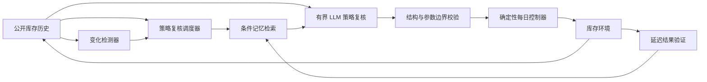

<div align="center">

# ShiftMem

### 面向环境变化的库存智能体条件记忆系统

一个证据优先的研究系统，用于分析：当需求或供应环境发生变化后，
LLM 智能体应当继续使用、修正，还是停用过去的运营经验。

[English](README.md) · [简体中文](README.zh-CN.md)

[](https://github.com/QCYTSN/Shiftmem/actions/workflows/ci.yml)


</div>

---

> ## 🔬 ShiftMem Evidence Lab
>
> 交互式回放完整的 160-cell 冻结实验，对比 ShiftMem 与 VectorMemory，
> 检查记忆生命周期，并将界面中的结果追溯到经过校验的正式证据。
>
> **[打开在线 Demo →](https://qcytsn.github.io/Shiftmem/)**<br>
> [本地启动](#运行-demo) · [Demo 使用说明](demo-web/README.md) ·
> [产品与证据完整性规范](docs/demo_design_spec.md) ·
> [正式实验审计](docs/v2_formal_post_test_audit.md)

## 项目概览

| | |
| --- | --- |
| **研究问题** | 面对需求和供应变化，条件记忆能否改善 LLM 引导的库存适应？ |
| **LLM 权限** | 只能调整三个有界策略参数；每日订货仍由确定性控制器执行 |
| **正式实验** | 160 个完整 cells、2 个模型、2 种方法、8 个留出场景、5 个配对种子 |
| **主要终点** | 70 个配对的变化适应样本 |
| **主要结论** | ShiftMem 整体上没有优于 VectorMemory |
| **证据状态** | 已冻结、已校验、可离线验证与复现 |

## 为什么需要 ShiftMem？

环境变化后，过去正确的运营经验可能变成误导。ShiftMem 不把记忆视为
永久有效的事实，而是带有适用条件、可以变化的经验：

- 经验会记录其形成时的环境条件；
- 环境变化可以让记忆进入休眠，而不是直接删除；
- 后续证据可以支持、降级或重新激活一条记忆；
- 策略提案必须明确引用实际检索到的记忆；
- 延迟到达的运营结果会更新记忆生命周期。

LLM **不能直接下达每日订单**，只能提出：

1. 需求预测窗口；
2. 安全库存系数；
3. 提前期缓冲。

真正的库存决策由共享的确定性控制器执行。智能体无法看到未来需求、
隐藏的 regime 标签或 Oracle 信息。



## 运行 Demo

Demo 是一个本地、只读的正式证据应用，不会调用模型服务，也不需要
API Key。

环境要求：Python 3.12+、Node.js 22+ 和 pnpm。

```powershell
git clone https://github.com/QCYTSN/Shiftmem.git
cd Shiftmem

py -3.12 -m venv .venv
.venv\Scripts\Activate.ps1
python -m pip install -e ".[test]"

# 校验证据并生成确定性的浏览器数据。
python -m demo.export_web

# 启动 Evidence Lab。
cd demo-web
corepack enable
pnpm install --frozen-lockfile
pnpm dev
```

浏览器打开 **http://127.0.0.1:5173**。

前端不会扫描原始运行目录。对于全新克隆的仓库，Python 会先校验已追踪
的冻结发布包及其中所需的证据文件，再生成浏览器可读取的视图模型。

Evidence Lab 包含四个互相关联的页面：

- **Episode Lab**：同步回放需求、库存、订单、成本、策略复核、fallback
  和环境变化；
- **Compare**：严格配对比较 ShiftMem 与 VectorMemory；
- **Memory Audit**：检查记忆的检索、引用、支持、失败、休眠与重新激活；
- **Evidence & Method**：展示数据来源、术语、汇总结果和明确的主张边界。

## 正式实验结果

预注册的 Protocol-v2 主要分析始终是权威结果。

| 分析 | ShiftMem − VectorMemory | 95% 区间 | p 值 | 解释 |
| --- | ---: | ---: | ---: | --- |
| 预注册主要分析 | +45.44 | [-2.72, 93.60] | 0.203 | 不支持 H1 |
| 聚类均值敏感性分析 | +45.44 | [11.26, 79.09] | 0.041 | 事后分析；对 ShiftMem 不利 |

正值代表 ShiftMem 的 30 天 Oracle-relative cost gap 更高。在 70 个主要
配对中，ShiftMem 胜 25、平 11、负 34。Test-ID 基本中性（-2.67），
Test-OOD 对 ShiftMem 不利（+81.53）；DeepSeek 与 MiniMax 的方法效应
方向也相反。

这是被完整保留的负结果，而不是“项目失败”：当前证据否定了普遍优越性
的强主张，同时显示记忆效果可能取决于模型和具体环境。

## 校验正式证据

验证过程确定、离线，而且不需要凭据：

```powershell
python -m pytest -q
python scripts/verify_release_archive.py
```

预期闭包状态：

- 160/160 个正式 cells；
- 70 个主要配对样本；
- 11/11 个原始证据来源校验通过；
- 0 个未解决 reservation；
- 闭包标识 `v2-formal-results-f4ab41daacf3`。

保留原始目录结构的研究工作区还可以重新生成并比较全部聚合结果：

```powershell
python scripts/finalize_formal_results.py --verify
```

### 主要证据入口

- [证据 manifest](artifacts/aggregated/v2_formal_evidence_manifest.json)
- [正式统计分析](artifacts/aggregated/v2_formal_statistical_analysis.json)
- [可靠性审计](artifacts/aggregated/v2_formal_reliability_audit.json)
- [冻结原始证据包](artifacts/releases/v2-formal-results-f4ab41daacf3-raw-evidence.zip)
- [证据包校验文件](artifacts/releases/v2-formal-results-f4ab41daacf3-raw-evidence.sha256.json)

## 可靠性也是实验结果

Provider 和解析失败均被保留在最终业务结果中：

| 信号 | 观测值 |
| --- | ---: |
| 策略复核 | 5,176 |
| Cell 内记录的调用尝试 | 6,189 |
| 解析失败 | 1,680（27.1%） |
| 保留原策略的 fallback | 667（复核的 12.9%） |
| Provider 终止失败 | 1,705 |
| 未解决 reservation | 0 |

因此，本实验评估的是包含 fallback 行为在内的实际系统表现，并没有把
“纯记忆机制”与模型指令遵循能力、Provider 可靠性完全分离。

## 仓库导航

| 路径 | 内容 |
| --- | --- |
| [`demo-web/`](demo-web/README.md) | 正式 React + TypeScript Evidence Lab |
| [`demo/`](demo/README.md) | 经过校验的 Python 证据适配与导出层 |
| [`src/shiftmem/`](src/shiftmem/) | 环境、智能体、记忆生命周期、控制器与评估 |
| [`configs/`](configs/) | 实验、数据划分、验证和冻结配置 |
| [`scripts/`](scripts/) | 校验、聚合与显式实验入口 |
| [`tests/`](tests/) | 单元与集成测试 |
| [`artifacts/aggregated/`](artifacts/aggregated/) | 机器可读的正式结果 |
| [`artifacts/releases/`](artifacts/releases/) | 冻结证据发布包及校验信息 |
| [`docs/`](docs/README.md) | 协议、审计、报告、模型卡和项目历史 |

## 适用范围

当前证据来自合成的单品缺货损失库存环境，覆盖两个 Provider 托管的模型
系列、一个三参数有界控制器，以及每个场景五个随机种子。它不能证明对
所有记忆系统的普遍优越性，也不能证明记忆休眠的因果收益，或直接推广到
真实的多品类企业库存系统。

完整解释、局限和允许提出的主张，请参阅
[正式 post-Test 审计](docs/v2_formal_post_test_audit.md)。

## 许可证

项目尚未选择开源许可证。在添加许可证之前，仓库虽然公开可见，但除适用
法律规定外，不自动授予代码或材料的再使用权。
