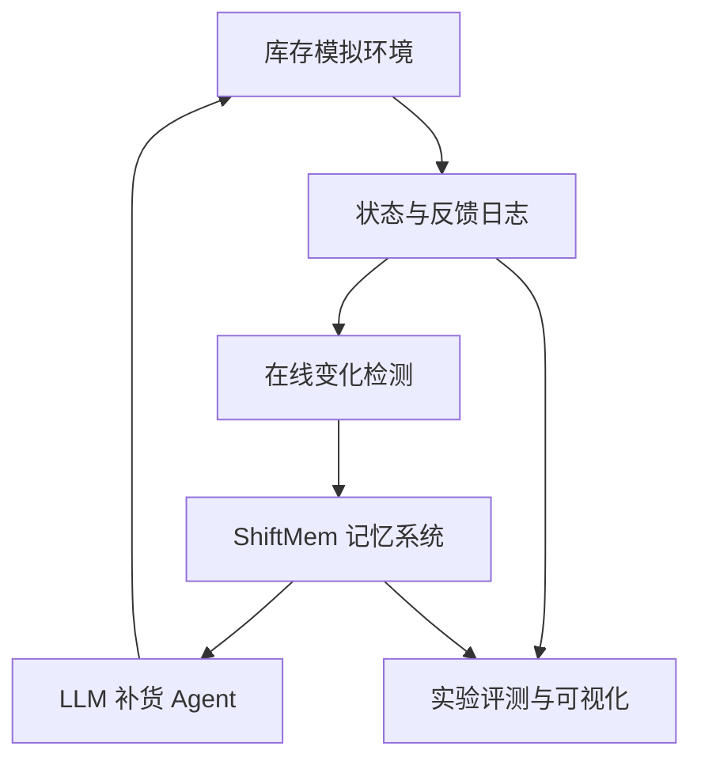
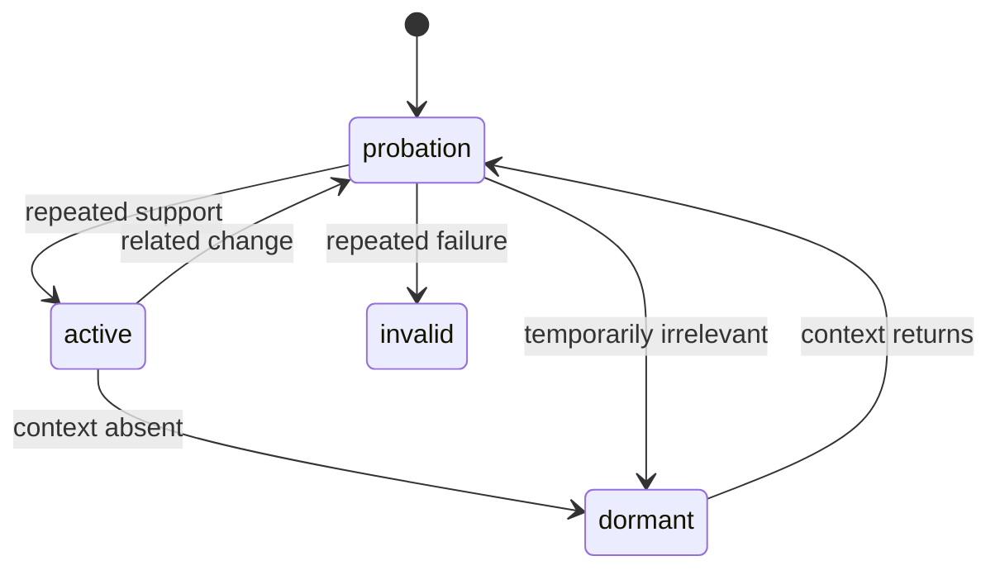

# ShiftMem 项目实施规格

> **项目全称**：ShiftMem: Change-Aware Conditional Memory for Inventory Agents under Regime Shifts  
> **项目类型**：人工智能研究项目 + 可复现实验系统 + 交互式 Demo + 研究论文  
> **预计周期**：14–16 周  
> **核心定位**：冻结基础语言模型，以外部变化感知条件记忆提升库存 Agent 在非平稳环境中的适应能力。  
> **文档状态**：v1.0，供本地 Codex 实施前审阅与拆解

---

## 1. 项目摘要

大型语言模型 Agent 在长期任务中常通过保存历史对话、摘要或向量检索来复用经验。这些方法通常默认历史经验持续有效。然而在真实商业环境中，需求、交货周期、采购成本和季节规律都会变化。语义上相似的历史经验，可能已经不再适用于当前环境，甚至持续诱导 Agent 做出错误决策。

本项目研究以下问题：

> 当库存经营环境发生突发、渐进、周期或组合变化时，LLM Agent 能否识别旧经验何时失效，并通过带适用条件、可信度和生命周期状态的外部记忆，更快恢复有效决策？

项目提出 **ShiftMem**：一种模型无关的 Change-Aware Conditional Memory。它将经验表示为带适用条件的结构化记录，结合在线变化检测、经验验证、生命周期管理和条件化检索，控制哪些经验能够进入 Agent 的决策上下文。

主要产出：

1. 一个可复现的非平稳库存模拟环境；
2. ShiftMem 外部记忆模块；
3. 六类记忆基线、传统库存策略和 Oracle 上限；
4. 完整实验、消融、泛化和成本分析；
5. 一篇结构完整的英文研究论文；
6. 一个“AI 库存经理实验室”交互 Demo。

---

## 2. 研究边界

### 2.1 项目要做什么

- 研究 Agent 经验在环境变化后的失效、验证、休眠和重新激活；
- 以电商库存与补货作为可控的商业实验场景；
- 冻结 LLM，不从头训练或微调模型；
- 使用统计变化检测与 LLM 推理的混合架构；
- 同时评价经营结果、适应速度、记忆质量、可靠性和推理成本；
- 保证方法可替换不同开源模型，不与单一 API 绑定。

### 2.2 项目不做什么

- 不预测真实股票价格或构建自动交易系统；
- 不声称 ShiftMem 完成真正的因果发现；
- 不从头训练大模型，不把 LoRA 微调列为必需范围；
- 主论文不做定价、营销、补货一体化的完整企业经营系统；
- 不依靠闭源模型产生核心结论；
- 不使用一次运行或单一模型结果证明方法有效。

### 2.3 “Conditional”而非“Causal”

经验可以记录“在促销、正常供应状态下，增加补货通常降低缺货率”，但除非加入干预或反事实验证，否则论文只将其称为条件性经验，不称为因果规律。

---

## 3. 研究问题与假设

### RQ1：适应性

ShiftMem 是否能降低环境变化后的累计额外成本，并缩短恢复到稳定表现所需的时间？

### RQ2：记忆有效性

ShiftMem 是否比完整历史、滚动摘要、语义向量检索和时间衰减记忆更少复用失效经验？

### RQ3：变化类型

ShiftMem 在突发、渐进、周期和未见组合变化下的收益是否一致？

### RQ4：模型泛化

ShiftMem 的效果能否跨不同模型系列和模型规模保持？

### RQ5：效率与审计

ShiftMem 是否能在可接受的 Token、延迟和记忆规模下，提供可追踪的经验状态变化和决策依据？

### 预注册式假设

- **H1**：ShiftMem 的变化后累计额外成本显著低于普通向量记忆；
- **H2**：ShiftMem 的失效经验错误复用率显著低于其他记忆基线；
- **H3**：在稳定环境中，ShiftMem 不会造成明显性能退化；
- **H4**：生命周期中的“休眠—重新激活”对周期变化特别重要；
- **H5**：统计变化检测器比仅依靠 LLM 判断变化更稳定且成本更低。

---

## 4. 系统架构



### 4.1 模块边界

| 模块 | 输入 | 输出 | 禁止耦合 |
|---|---|---|---|
| Inventory Environment | 动作、随机种子、情景配置 | observation、reward、info | 不调用 LLM |
| Change Detector | 在线数值序列 | 变化信号 | 不直接修改记忆 |
| Memory Store | 经验对象和更新事件 | 可查询的经验集合 | 不包含 UI 逻辑 |
| Memory Retriever | 当前状态、变化信号、记忆集合 | Top-k 经验 | 不生成最终动作 |
| Agent | observation、Top-k 经验 | 结构化补货动作 | 不访问隐藏真实状态 |
| Evaluator | 日志、隐藏真值 | 指标、表格、图 | 不改变运行结果 |
| Demo | 已定义的公共接口 | 交互界面 | 不复制核心算法 |

---

## 5. 库存模拟环境

### 5.1 标准接口

环境应接近 Gymnasium，但首版可自行定义最小接口：

```python
observation, info = env.reset(seed=42)
observation, reward, terminated, truncated, info = env.step(action)
```

动作至少包含：

```json
{
  "order_quantity": 120,
  "supplier_id": "standard"
}
```

首版只允许一个供应商时，保留 `supplier_id` 字段但设为常量，以便后期扩展。

### 5.2 Agent 可见状态

- 当前库存；
- 在途订单及预计到货日；
- 最近 N 天销量；
- 最近 N 天缺货量；
- 当前采购成本和售价；
- 星期、节假日和是否促销；
- 可选外生信号，例如搜索热度；
- ShiftMem 检索出的少量经验。

Agent 不得看到：

- 真实需求分布参数；
- 预设变化发生时间；
- 隐藏的环境 regime ID；
- 未来需求或未来交货延迟。

### 5.3 基础需求模型

建议首版使用：

\[
D_t \sim \text{NegBinomial}(\mu_t, \kappa)
\]

\[
\mu_t = b_t \cdot s_t \cdot p_t \cdot x_t
\]

其中：

- \(b_t\)：基础需求水平；
- \(s_t\)：星期或季节因子；
- \(p_t\)：促销因子；
- \(x_t\)：其他外生影响；
- \(\kappa\)：控制需求过度离散程度。

使用负二项分布而非只有泊松分布，以容纳商业销量中的过度离散。泊松版本保留为简单测试环境。

### 5.4 成本与奖励

至少包含：

- 采购成本；
- 持有成本；
- 缺货或丢失销售成本；
- 可选固定订货成本；
- 可选服务水平惩罚。

统一最小化总成本：

\[
C_t=C_t^{purchase}+C_t^{holding}+C_t^{stockout}+C_t^{ordering}
\]

环境奖励定义为 \(R_t=-C_t\)。利润可作为辅助指标，但主论文以成本和服务水平为主，减少价格假设带来的干扰。

### 5.5 Regime Shift 类型

1. **稳定**：参数只含随机噪声；
2. **突发需求变化**：某日开始需求均值上升或下降；
3. **渐进需求漂移**：需求均值在一段时间连续变化；
4. **突发供应变化**：交货周期或到货完整率改变；
5. **周期变化**：节假日或季节模式反复出现；
6. **组合变化**：需求上升与供应延迟同时或错位发生；
7. **虚警情景**：短期异常后恢复，用于检验检测器是否过度反应。

每个情景配置必须通过 YAML/JSON 声明，并支持确定性种子复现。

### 5.6 环境测试

- 同种子产生完全一致的轨迹；
- 库存守恒：期末库存等于期初库存加到货减销售；
- 不允许负库存，除非明确采用 backorder 模式；
- 订单只在交货周期结束后到货；
- 隐藏状态不进入 Agent observation；
- 每类 shift 的实际轨迹与配置一致；
- Oracle 在简化环境中应优于随机策略。

---

## 6. ShiftMem 方法

### 6.1 经验数据结构

建议使用 Pydantic 定义：

```python
class MemoryItem(BaseModel):
    memory_id: str
    statement: str
    conditions: dict[str, Any]
    source_window: tuple[int, int]
    linked_variables: list[str]
    confidence: float
    status: Literal["active", "probation", "dormant", "invalid"]
    use_count: int
    success_count: int
    failure_count: int
    estimated_utility: float
    created_at: int
    last_retrieved_at: int | None
    last_validated_at: int | None
    evidence_refs: list[str]
```

所有状态变化写入不可变审计日志：

```python
class MemoryEvent(BaseModel):
    event_id: str
    memory_id: str
    step: int
    old_status: str | None
    new_status: str
    confidence_before: float | None
    confidence_after: float
    reason_code: str
    evidence_refs: list[str]
```

### 6.2 经验抽取

不要每轮都生成经验。首版采用事件触发：

- 每 K 天周期总结；
- 变化检测器触发；
- 发生明显缺货或积压；
- 某项决策产生显著正/负结果。

经验抽取输出必须符合 JSON Schema，并保留产生它的原始日志引用。

### 6.3 在线变化检测

首版实现两种检测器：

- Page-Hinkley；
- ADWIN。

统一输出：

```python
class ChangeSignal(BaseModel):
    variable: str
    score: float
    direction: Literal["increase", "decrease", "unknown"]
    detected_at: int
    suspected_start: int | None
    detector: str
```

变化信号不能直接判定所有记忆失效，只将相关经验移入 `probation` 并提高验证优先级。

### 6.4 生命周期状态机



- `active`：当前条件下可靠，可正常检索；
- `probation`：条件或规律可能变化，降低排序并等待验证；
- `dormant`：当前情境不适用，但未来可能恢复；
- `invalid`：证据持续反驳，默认不检索但保留审计记录。

禁止在单次失败后永久删除经验。

### 6.5 可信度更新

首版使用透明、可解释的 Beta-Bernoulli 更新或指数加权成功率，不要立即交给 LLM 自由打分。

例如：

\[
q_i=\frac{\alpha_i}{\alpha_i+\beta_i}
\]

成功验证更新 \(\alpha_i\)，失败验证更新 \(\beta_i\)。变化发生后可提高失败证据权重，具体权重作为超参数并在开发集选择。

### 6.6 条件化检索

两阶段检索：

1. **硬过滤**：状态、适用条件、关联变量；
2. **软排序**：语义相关度、可信度、新鲜度、历史效用、变化相关惩罚。

推荐初始评分：

\[
S_i=w_s S_i^{semantic}+w_c S_i^{confidence}+w_r S_i^{recency}+w_u S_i^{utility}-w_p S_i^{shift\ penalty}
\]

权重必须在开发情景中确定，测试集不得重新调参。

### 6.7 决策后的经验验证

需要明确“成功”的延迟窗口。一次补货决策的效果不能在当天完全观察，验证应根据订单到货和后续若干天服务水平计算。验证逻辑必须由确定性评估器完成，LLM 只负责生成或重写经验陈述。

---

## 7. Agent 设计

### 7.1 结构化输出

```json
{
  "order_quantity": 120,
  "used_memory_ids": ["mem_014", "mem_031"],
  "confidence": 0.72,
  "reason": "Demand has risen while lead time is under probation."
}
```

- `order_quantity` 必须经过环境边界校验；
- 无法解析时重试一次；
- 第二次仍失败则采用安全 fallback 策略并记录失败；
- 决策理由不参与主要经营评分；
- `used_memory_ids` 用于计算记忆错误复用率和忠实度。

### 7.2 模型策略

- 开发阶段：较小开源指令模型或廉价模型；
- 正式实验：2–3个开源模型，至少来自两个模型系列；
- 闭源强模型：仅可作为附加性能上限，不产生论文核心结论；
- 所有模型使用统一 observation、action schema 和近似相同的提示信息；
- temperature 主实验设为 0 或较低值，随机性通过多种子测试补充。

具体模型应在正式实验前根据当时可用版本、许可证、显存和结构化输出能力确定，不在本规格中锁死过时型号。

---

## 8. Baseline 与公平比较

### 8.1 Agent 记忆基线

1. `NoMemoryAgent`：仅看当前 observation；
2. `FullHistoryAgent`：在上下文预算允许范围内提供最近完整历史；
3. `SummaryMemoryAgent`：维护滚动自然语言摘要；
4. `VectorMemoryAgent`：按语义相似度检索 Top-k；
5. `TimeDecayMemoryAgent`：相关度结合时间衰减；
6. `ShiftMemAgent`：完整方法。

### 8.2 非 LLM 基线

- 随机或固定订货策略，仅用于环境 sanity check；
- 移动平均预测 + 再订货点；
- 指数平滑预测 + 安全库存；
- 已知分布参数的 Oracle 策略。

### 8.3 公平性规则

- Agent 基线使用相同基础模型；
- 每轮最大输入 Token 和检索条数尽量一致；
- 相同情景使用相同随机种子与需求轨迹；
- 所有方法使用相同动作空间和状态信息；
- 记录真实 Token、延迟和失败重试；
- 开发集用于调参，测试集一次性冻结运行。

---

## 9. 实验设计

### 9.1 数据划分

模拟情景按生成参数划分：

- Train/Development：用于代码调试和超参数选择；
- Validation：选择检测器、阈值、检索权重；
- Test-ID：相同变化类型但新参数和新种子；
- Test-OOD：未见变化幅度、时点和组合。

不能仅用不同随机种子作为 OOD；OOD 必须包含未见参数范围或组合结构。

### 9.2 核心实验矩阵

建议主论文控制在：

- 4个主要情景组：稳定、突发、渐进、周期/组合；
- 6种 Agent 记忆方法；
- 2个主要开源模型，第三个模型作为补充；
- 每个配置至少5个环境随机种子；
- 每个 episode 120–180天。

先运行小规模 pilot，根据方差做功效分析，再决定是否增加种子。不要一开始运行全部笛卡尔积。

### 9.3 主要指标

#### 经营表现

- Total Cost；
- Stockout Rate；
- Fill Rate；
- Holding Cost；
- Lost Sales；
- Average Inventory。

#### 变化适应

- Detection Delay；
- Recovery Time；
- Post-shift Regret @ 7/14/30 days；
- 相对 Oracle 的累计 Regret。

#### 记忆质量

- Invalid Memory Reuse Rate；
- Applicable Memory Precision@k；
- Dormant Memory Reactivation Accuracy；
- Memory Churn；
- Memory Store Size。

#### 效率和可靠性

- 输入/输出 Token；
- 单步延迟；
- JSON 解析失败率；
- 不同种子方差；
- 单位性能提升的推理成本。

### 9.4 消融实验

- `ShiftMem - Change Detection`；
- `ShiftMem - Conditions`；
- `ShiftMem - Confidence Update`；
- `ShiftMem - Dormancy/Reactivation`；
- 只用时间排序；
- 只用语义相似度；
- LLM 变化判断替代统计检测器；
- Page-Hinkley 与 ADWIN 替换。

### 9.5 统计分析

- 报告均值、标准差和95%置信区间；
- 对相同需求轨迹上的方法使用配对检验；
- 若分布明显非正态，采用 Wilcoxon signed-rank test；
- 多重比较时做 Holm 校正；
- 同时报告效应量，不只报告 p 值；
- 提前指定一个主要指标：建议 `Post-shift cumulative regret @30`。

### 9.6 失败标准

以下结果也必须如实记录：

- ShiftMem 在稳定环境造成显著额外成本；
- 传统库存策略稳定优于所有 LLM Agent；
- 变化检测虚警导致记忆频繁失效；
- 一个模块只对单一模型有效；
- Token 成本远高于性能收益。

即使方法未全面胜出，论文仍可转为对 Agent 记忆失效机制的诊断研究，但不能事后更改评价指标掩盖失败。

---

## 10. Demo 规格

Demo 名称：**AI Inventory Manager Lab**。

### 10.1 必需功能

- 设置需求、库存、交货周期和成本；
- 选择记忆方法；
- 触发需求突变、渐进漂移、供应延迟和季节回归；
- 单步运行、自动运行、暂停和重置；
- 展示库存、销量、订单、缺货和累计成本曲线；
- 并排比较两个 Agent；
- 展示每轮动作、理由和使用的记忆；
- 展示记忆状态、可信度和状态变化原因。

### 10.2 记忆审计面板

每条记忆支持查看：

- 内容和适用条件；
- 来源日志；
- 当前状态和可信度；
- 被哪些决策调用；
- 支持/反驳证据；
- 状态变化时间线。

### 10.3 技术选择

首选 Streamlit；若需要更复杂前后端交互，再考虑 FastAPI + React。研究阶段禁止先做独立前端，Demo 必须复用核心 Python 包和实验日志。

---

## 11. 推荐仓库结构

```text
shiftmem/
├── README.md
├── pyproject.toml
├── configs/
│   ├── environments/
│   ├── agents/
│   └── experiments/
├── src/shiftmem/
│   ├── envs/
│   │   ├── inventory_env.py
│   │   ├── demand_models.py
│   │   ├── supply_models.py
│   │   └── shifts.py
│   ├── agents/
│   │   ├── base.py
│   │   ├── llm_agent.py
│   │   ├── classical.py
│   │   └── oracle.py
│   ├── memory/
│   │   ├── schemas.py
│   │   ├── store.py
│   │   ├── extractor.py
│   │   ├── retriever.py
│   │   ├── validator.py
│   │   └── lifecycle.py
│   ├── detection/
│   │   ├── base.py
│   │   ├── page_hinkley.py
│   │   └── adwin.py
│   ├── evaluation/
│   │   ├── metrics.py
│   │   ├── statistics.py
│   │   └── plots.py
│   ├── providers/
│   │   ├── base.py
│   │   ├── local.py
│   │   └── compatible_api.py
│   └── logging/
│       ├── schemas.py
│       └── run_logger.py
├── scripts/
│   ├── run_episode.py
│   ├── run_experiment.py
│   ├── aggregate_results.py
│   └── make_paper_figures.py
├── demo/
│   └── app.py
├── tests/
│   ├── unit/
│   ├── integration/
│   └── regression/
├── artifacts/
│   ├── raw_runs/
│   ├── aggregated/
│   └── figures/
├── paper/
│   ├── main.tex
│   └── references.bib
└── docs/
    ├── experiment_protocol.md
    ├── memory_schema.md
    └── model_card.md
```

`artifacts/raw_runs` 默认不提交大型结果文件；提交小型示例、汇总数据和可复现配置。

---

## 12. 14–16 周路线图

### Phase 0：文献与研究协议（第1–2周）

- 系统阅读 Agent memory、concept drift、inventory control 和 agent evaluation；
- 建立 related-work 矩阵；
- 冻结 RQ、主要指标、数据划分和主实验规则；
- 写 `docs/experiment_protocol.md`；
- 明确哪些选择在看测试结果后不得修改。

**验收**：研究协议完整，无 TBD；能解释与现有 Agent memory 和商业模拟工作的差异。

### Phase 1：环境与传统基线（第3–4周）

- 实现单商品环境和全部 shift 类型；
- 完成固定策略、移动平均、指数平滑和 Oracle；
- 完成确定性、守恒和隐藏信息测试；
- 生成第一批无 LLM 曲线。

**验收**：100个不同种子批量运行无异常；Oracle 合理领先；所有 shift 可视化正确。

### Phase 2：统一 Agent 接口与简单记忆（第5–6周）

- 实现 provider 抽象和 JSON 输出校验；
- 完成 NoMemory、FullHistory、Summary、Vector、TimeDecay；
- 记录 Token、延迟、失败和完整决策日志；
- 用小模型完成短 episode 端到端运行。

**验收**：同一情景可一条命令切换全部基线；解析失败有安全 fallback。

### Phase 3：ShiftMem 核心方法（第7–9周）

- 实现经验 schema、审计事件和 store；
- 实现变化检测器统一接口；
- 实现生命周期状态机和可信度更新；
- 实现两阶段条件检索；
- 完成组件级单元测试和集成测试。

**验收**：预设轨迹中记忆能按预期经历 active/probation/dormant/reactivation；无 LLM 自由打分控制关键状态。

### Phase 4：Pilot 与设计冻结（第10周）

- 小规模比较检测器和检索权重；
- 估计方差、推理时间和正式实验成本；
- 检查指标是否可计算；
- 冻结测试配置和随机种子清单。

**验收**：生成 pilot 报告；正式测试配置哈希锁定；不使用 Test-OOD 调参。

### Phase 5：正式实验（第11–12周）

- 运行主实验；
- 运行关键消融和跨模型实验；
- 聚合结果并完成统计检验；
- 对异常结果做预先定义的诊断，不随意删除失败运行。

**验收**：所有表格可由脚本从原始日志一键重建；实验有配置、版本、种子和模型标识。

### Phase 6：论文与 Demo（第13–14周）

- 完成论文初稿、主表和图；
- 实现 Streamlit Demo；
- 完成记忆审计面板和双 Agent 对比；
- 整理 README 和复现命令。

**验收**：新环境从零安装后可跑最小示例；论文每个核心主张有对应实验。

### Phase 7：缓冲与提升（第15–16周，可选）

- 增加多商品或第二供应商扩展；
- 增加第三个模型；
- 做人工案例分析；
- 修改论文表达和可视化；
- 仅在核心项目完成后考虑反事实验证扩展。

---

## 13. 工程质量要求

### 13.1 配置与复现

- 配置文件驱动所有实验；
- 保存 Git commit、依赖版本、模型标识、设备、种子和配置副本；
- 禁止在实验脚本中散落硬编码参数；
- 汇总和画图只读取日志，不手工修改结果表。

### 13.2 测试

- 环境、检测器、生命周期、可信度更新和指标必须有单元测试；
- 至少一个无网络、无 LLM 的端到端集成测试；
- 至少一个使用 mock provider 的 Agent 集成测试；
- 修复 bug 时先增加回归测试。

### 13.3 隐私与凭证

- API key 只通过环境变量读取；
- `.env` 不提交；
- 日志不保存密钥或完整鉴权头；
- provider 实现不得与研究逻辑耦合。

---

## 14. 风险与降级方案

| 风险 | 预警信号 | 降级方案 |
|---|---|---|
| LLM 推理成本过高 | Pilot 单配置耗时过长 | 先筛选配置，只对最终矩阵使用较强模型 |
| 环境过于简单 | 所有方法结果接近 | 增加供应变化、虚警和组合变化，不盲目增加商品数 |
| 环境过于复杂 | 传统基线也不稳定 | 回退单商品、单供应商并提高可解释性 |
| 变化检测虚警多 | 稳定环境频繁 probation | 独立校准检测阈值，增加短期异常情景 |
| ShiftMem 不优于向量记忆 | 错误复用率无改善 | 转为诊断研究，分析失效机制，不更换主指标 |
| LLM 不遵守动作格式 | 解析失败率高 | 约束解码、一次重试和安全 fallback |
| 实验组合爆炸 | 预计运行量持续增长 | 坚持主实验矩阵，扩展实验进入附录或取消 |

---

## 15. 论文结构建议

1. **Introduction**：经验复用在非平稳环境中的风险；
2. **Related Work**：Agent memory、concept drift、LLM business agents、inventory simulation；
3. **Problem Formulation**：POMDP式库存任务、regime shift、条件记忆；
4. **ShiftMem**：经验结构、变化检测、生命周期、检索与验证；
5. **Experimental Setup**：环境、基线、模型、指标和统计协议；
6. **Results**：主结果、变化类型、跨模型、效率；
7. **Analysis**：消融、失败案例、记忆审计、传统方法比较；
8. **Limitations and Ethics**：模拟环境外部有效性、LLM不稳定性、不可直接部署；
9. **Conclusion**。

避免在完成实验前预写“显著优于”等结果性措辞。

---

## 16. Definition of Done

项目只有同时满足以下条件才算完成：

- 环境和所有 shift 可配置、可测试、可复现；
- 传统策略、Oracle 和六类 Agent 记忆方法都能运行；
- ShiftMem 的每个状态变化都有审计事件；
- 正式实验不依赖手工操作；
- 主表、消融表和主要图可以从日志一键生成；
- 至少两个开源模型完成主实验；
- 报告多随机种子、置信区间、效应量和统计检验；
- Demo 能对比 Agent 并查看记忆生命周期；
- README 能指导新用户运行最小示例；
- 英文论文初稿完整，核心主张均有证据支持；
- 论文明确承认模拟环境和非因果定位的限制。

---

## 17. 交给本地 Codex 的启动指令

将本文件放入一个新建 Git 仓库根目录，然后向 Codex 提供以下指令：

```text
请先完整阅读 ShiftMem_Implementation_Spec.md。

当前任务不是一次性实现整个项目，也不要立即接入任何真实 LLM API。
请先执行以下工作：

1. 检查当前仓库状态、可用 Python 版本和已有文件；
2. 将规格拆成按依赖排序的详细实施计划；
3. 标出所有需要我决定的研究或工程选项，但不要重复询问规格中已经明确的选择；
4. 第一阶段只搭建项目骨架、库存环境、情景配置、传统基线和测试；
5. 使用测试驱动方式实现，每个阶段完成后运行测试并汇报证据；
6. 在环境与传统基线通过验收前，不实现 ShiftMem，不调用真实模型；
7. 不修改研究问题、主要指标或实验公平性规则，若发现设计问题先说明并请求确认；
8. 保存所有实现决策和偏差到 docs/implementation_log.md。

现在先输出实施计划和 Phase 1 的文件级任务列表，等待我确认后再修改代码。
```

### 推荐的第一次实施范围

本地 Codex 第一次只应完成：

- `pyproject.toml`；
- `src/shiftmem/envs/`；
- `src/shiftmem/agents/classical.py`；
- 基础配置文件；
- 对应单元测试；
- 一个无 LLM 的 episode 运行脚本；
- 一张用于验证环境行为的曲线。

不要在第一次任务中创建完整 Demo、论文或真实 provider。

---

## 18. 实施前仍需确认的少量决策

这些决定可以在 Phase 0/1 中通过 pilot 确定，无需阻塞仓库骨架：

1. 使用 lost sales 还是 backorder 作为主环境；建议主实验 lost sales，backorder 作为扩展；
2. episode 主长度使用120、150或180天；建议150天；
3. 主要 detector 使用 Page-Hinkley 还是 ADWIN；先都实现，Validation 后选择；
4. 正式开源模型型号；在正式实验前按可用性和显存决定；
5. 检索 Top-k 和评分权重；只允许在 Validation 选择；
6. 是否增加第二供应商；仅在单供应商核心实验稳定后决定。

本规格默认不将这些选项视为改变项目研究方向。
