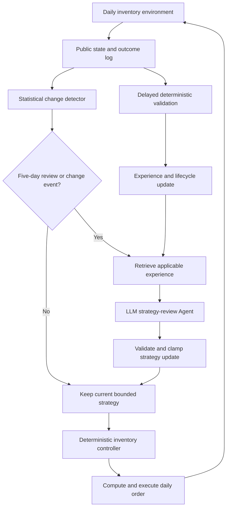

# ShiftMem v2 Hierarchical Strategy-Agent Design

Date: 2026-07-14

Status: approved direction; documentation amendment before implementation

Test-ID/Test-OOD outcomes accessed: false

## Purpose

ShiftMem studies whether change-aware conditional memory helps an inventory Agent stop reusing invalid experience and adapt after demand or supply regimes change. The primary contribution is the memory and adaptation mechanism, not an LLM's ability to calculate a precise daily order quantity.

Protocol v1 made the LLM emit `order_quantity` on every scored day. That design confounds memory quality with arithmetic ability, formatting reliability, and high-frequency model noise. It also makes the formal matrix unnecessarily expensive.

Version 2 changes the Agent into a low-frequency strategy reviewer. A deterministic inventory controller remains responsible for every daily order. The LLM may only update a small, bounded strategy parameter vector at a fixed periodic review or when a public-signal detector raises an event.

## Research continuity

The project title, ShiftMem mechanism, RQ1--RQ5, H1--H5, primary endpoint, scenario splits, and no-test-tuning rule remain applicable.

- H1 continues to compare ShiftMem with VectorMemory on post-shift cumulative regret.
- H2 measures invalid strategy-experience reuse rather than invalid experience cited in a direct daily order.
- H3 evaluates whether unnecessary reviews or parameter changes degrade a stable regime.
- H4 continues to test dormancy/reactivation under periodic recurrence.
- H5 compares statistical event triggering with an explicitly defined LLM-only change-judgment ablation.

The unit influenced by the LLM changes from a daily order to a strategy revision. Daily inventory cost, service, regret, and recovery metrics remain the outcome units.

## Architecture



Retrieval occurs before an LLM review. Experience extraction, confidence updates, and lifecycle transitions occur only after sufficient public outcomes are available. The detector never directly changes an order or strategy parameter.

## Component contracts

### Review scheduler

The default periodic review interval is fixed at five completed days. A related detector signal may request an additional review. Periodic and event triggers on the same day are coalesced into one provider call. The LLM cannot modify the review interval.

The scheduler records trigger type, detection evidence, last review day, and whether triggers were coalesced. A cooldown prevents repeated detector alerts from producing uncontrolled calls; its value must be selected on Development/Validation and frozen.

### Strategy-review Agent

The Agent receives only public history, current validated strategy parameters, the trigger reason, and the memory context supplied by the selected method. It returns a bounded strategy proposal, cited memory IDs, confidence, and a short reason. It does not return `order_quantity`.

The initial candidate parameter vector is:

```json
{
  "forecast_window": 14,
  "safety_stock_multiplier": 1.2,
  "lead_time_buffer": 1,
  "used_memory_ids": ["mem_014"],
  "confidence": 0.72,
  "reason": "Recent demand and lead-time evidence support a larger buffer."
}
```

Exact bounds and defaults are Validation decisions. The parameter set must remain small; the review interval, controller formula, supplier, and daily order are not model-controlled. Invalid output receives one schema-correction retry and then retains the previous valid strategy as the safe fallback.

### Deterministic inventory controller

The controller forecasts demand from public history and computes a daily order-up-to target from the frozen strategy parameters, public quoted lead time, and inventory position. Its output is a non-negative integer daily order that still passes environment validation.

All LLM memory methods use the same controller implementation, initial strategy, parameter bounds, scheduler, public information, and fallback. A controller-only fixed-parameter policy, a deterministic rule-adaptation policy, and Oracle remain non-LLM contextual baselines.

### Strategy experience

An experience records the public context, trigger, previous and proposed parameter values, cited memories, and realized delayed outcomes. Validation evaluates a complete post-review window rather than the order day. An experience is counted as reused only when it was supplied to and cited by a successful strategy revision; retrieval alone is reported separately.

Existing applicability predicates, Beta-Bernoulli evidence, lifecycle states, audit events, and conditional retrieval remain in force. Hidden regime IDs, shift schedules, future demand, and Oracle parameters remain prohibited.

## Experimental design

The primary confirmatory comparison is deliberately narrow:

- eight held-out Test-ID/Test-OOD scenarios already declared, including stable and periodic coverage;
- ten paired seeds per scenario;
- two qualified core models;
- VectorMemory versus ShiftMem;
- identical deterministic controller and review schedule.

This gives 320 primary model-method cells. Ten seeds is a bounded undergraduate-study design; inference emphasizes paired effect sizes and confidence intervals and does not claim the power of the retired 52-seed plan.

Secondary memory baselines use DeepSeek only, five paired seeds, and the same eight scenarios:

- NoMemory;
- FullHistory;
- Summary;
- TimeDecay.

Targeted experiments replace a full factorial ablation matrix:

- H3 uses the held-out stable scenario;
- H4 compares ShiftMem with and without dormancy/reactivation on periodic recurrence;
- H5 compares the statistical trigger with an LLM-only judgment variant on change scenarios;
- classical fixed, adaptive-rule, and Oracle controllers run without a provider.

The final number of calls, review cooldown, strategy bounds, delayed validation window, and budget are selected in a new Development/Validation Pilot. No v2 Test execution is authorized before those values, the protocol, configurations, and hashes are frozen.

## Metrics and attribution

The primary endpoint remains `post_shift_cumulative_regret_30`, calculated from all daily outcomes. Recovery, total cost, fill rate, stockouts, invalid memory reuse, dormant reactivation, token count, latency, parse failures, fallback rate, and memory size remain.

Version 2 adds:

- scheduled and event-triggered review counts;
- coalesced and cooldown-suppressed triggers;
- strategy parameter magnitude and churn;
- invalid strategy proposal rate;
- retained-strategy fallback count;
- cost per successful strategy revision.

Results must distinguish whether a performance change came from detection timing, memory retrieval, the strategy proposal, or deterministic execution.

## Existing work and migration

Reusable without conceptual change:

- inventory environment and scenario generators;
- deterministic random streams and classical acceptance evidence;
- Page-Hinkley, ADWIN, and public signal routing;
- ShiftMem store, retrieval, lifecycle, confidence, and audit machinery;
- provider abstraction, qualification evidence, journaling, replay, and budget gates;
- split validation, result schemas, statistics, and freeze verification.

Requires implementation changes after this design is reviewed:

- Agent decision schema and prompt;
- review scheduler and trigger coalescing;
- deterministic parameterized controller;
- experience extraction and delayed validation semantics;
- baseline orchestration and formal runner;
- configuration schemas, aggregate fields, and figures.

The v1 freeze remains immutable. The v1 Pilot and live Validation run remain valid only as bounded engineering, provider, logging, and historical cost evidence. They are not performance evidence for v2 and are not merged with v2 outcomes.

## Cost and compute policy

The retired v1.1 full-matrix estimate is not a v2 budget. A new Validation Pilot must measure calls and tokens before any formal cap is proposed.

Inventory simulation, detectors, memory, statistics, and API orchestration remain CPU-capable. API token fees already pay for provider-side inference. A rented GPU is optional and must correspond to a separately declared local-model experiment; it is not required merely to run the simulator or call remote APIs. At the user-provided CNY 3/hour rate, GPU cost is recorded as hours multiplied by three plus an explicit setup/retry reserve. API and self-hosted inference costs must not be double-counted for the same run.

## Failure handling and governance

- A failed or invalid LLM review cannot prevent the environment from advancing; the last valid strategy remains active.
- Provider attempts, including failures, are journaled before execution continues.
- Repeated detector alerts respect the frozen cooldown and remain auditable.
- No Test-ID/Test-OOD outcome is generated during migration, controller calibration, prompt revision, or the v2 Pilot.
- Any change to controller formula, strategy bounds, scheduler, primary comparison, endpoint, or seeds after the v2 freeze requires a numbered amendment.

## Documentation and implementation order

1. Mark protocol v1.1 and its budget as retired before Test execution.
2. Issue the v2 implementation specification and draft experiment protocol.
3. Implement the scheduler, strategy schema, controller, strategy experience, and formal orchestration using test-driven development.
4. Requalify the two core models on the strategy-review schema.
5. Run Development/Validation-only controller calibration and v2 Pilot.
6. Finalize the v2 call/token/GPU budget and statistical seed declaration.
7. Create and verify a clean v2 freeze.
8. Begin held-out execution only after explicit budget and freeze approval.
